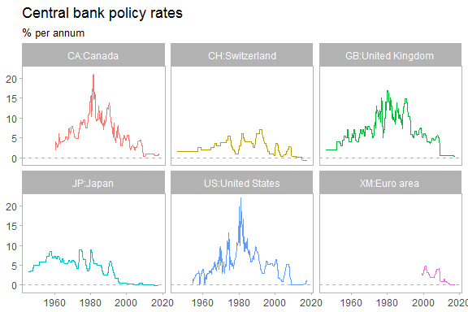

[](http://cran.r-project.org/package=BIS) [](https://travis-ci.org/expersso/BIS) [](https://codecov.io/github/expersso/BIS?branch=master) [](http://cran.r-project.org/package=BIS)

BIS
===

The `BIS` package package provides an `R` interface to data hosted by the [Bank for International Settlements](https://www.bis.org).

The package can be installed from either CRAN or Github.

``` r
library(devtools)
install_github("expersso/BIS") # Github
install.packages("BIS")        # CRAN
```

### Example usage

The `get_datasets` downloads a list of available datasets.

``` r
library(BIS)

datasets <- get_datasets()
head(datasets, 20)
## # A tibble: 17 x 2
##    name                                                     url           
##    <chr>                                                    <chr>         
##  1 Locational banking statistics                            https://www.b~
##  2 Consolidated banking statistics                          https://www.b~
##  3 Debt securities statistics                               https://www.b~
##  4 Global liquidity indicators                              https://www.b~
##  5 Credit to the non-financial sector                       https://www.b~
##  6 Credit-to-GDP gaps                                       https://www.b~
##  7 Debt service ratios for the private non-financial sector https://www.b~
##  8 Property prices: selected series                         https://www.b~
##  9 Property prices: long series                             https://www.b~
## 10 US dollar exchange rates (monthly, quarterly and annual) https://www.b~
## 11 US dollar exchange rates (daily)                         https://www.b~
## 12 Effective exchange rate indices (monthly)                https://www.b~
## 13 Effective exchange rate indices (daily)                  https://www.b~
## 14 Triennial Survey statistics on turnover                  https://www.b~
## 15 Consumer prices                                          https://www.b~
## 16 Policy rates (monthly)                                   https://www.b~
## 17 Policy rates (daily)                                     https://www.b~
```

The function `get_bis` takes a url as input and downloads and parses the corresponding CSV file from the BIS website. This automatic parsing of the data is the major contribution of this package, since the different CSVs follow different formats.

The following code loads monthly data on central banks' policy rates:

``` r
rates <- get_bis(datasets$url[16], quiet = TRUE)
head(rates)
## # A tibble: 6 x 6
##   freq  frequency ref_area reference_area date    obs_value
##   <chr> <chr>     <chr>    <chr>          <chr>       <dbl>
## 1 M     Monthly   CH       Switzerland    1946-01      1.50
## 2 M     Monthly   DK       Denmark        1946-01      3.50
## 3 M     Monthly   GB       United Kingdom 1946-01      2.00
## 4 M     Monthly   IN       India          1946-01      3.00
## 5 M     Monthly   JP       Japan          1946-01      3.29
## 6 M     Monthly   SE       Sweden         1946-01      2.50
```

We plot these data for a subset of countries.

``` r
library(dplyr)
library(ggplot2)
library(zoo)

rates_plot <- rates %>%
  mutate(date = as.Date(as.yearmon(date))) %>%
  filter(grepl("^(XM|US|CH|JP|GB|CA)", ref_area))

ggplot(rates_plot, aes(date, obs_value, color = reference_area)) +
  geom_hline(yintercept = 0, linetype = "dashed",
             color = "grey70", size = 0.02) +
  geom_line(show.legend = FALSE) +
  facet_wrap(~reference_area) +
  theme_light() +
  theme(panel.grid = element_blank()) +
  labs(x = NULL, y = NULL,
       title = "Central bank policy rates",
       subtitle = "% per annum")
```



Note that the BIS data sets come with a number of different time formats, so it's up to the user to parse these for himself/herself. The `zoo` package (especially `as.yearqtr` and `as.yearmon`) should take care of most cases.

Please also note that some datasets are fairly large (especially the first three returned by `get_datasets`), so you may need to run 64-bit R in order to load all the data into memory.

Finally, please don't abuse BIS's servers with unnecessary calls.

### Disclaimer

This package is in no way officially related to, or endorsed by, the BIS.
